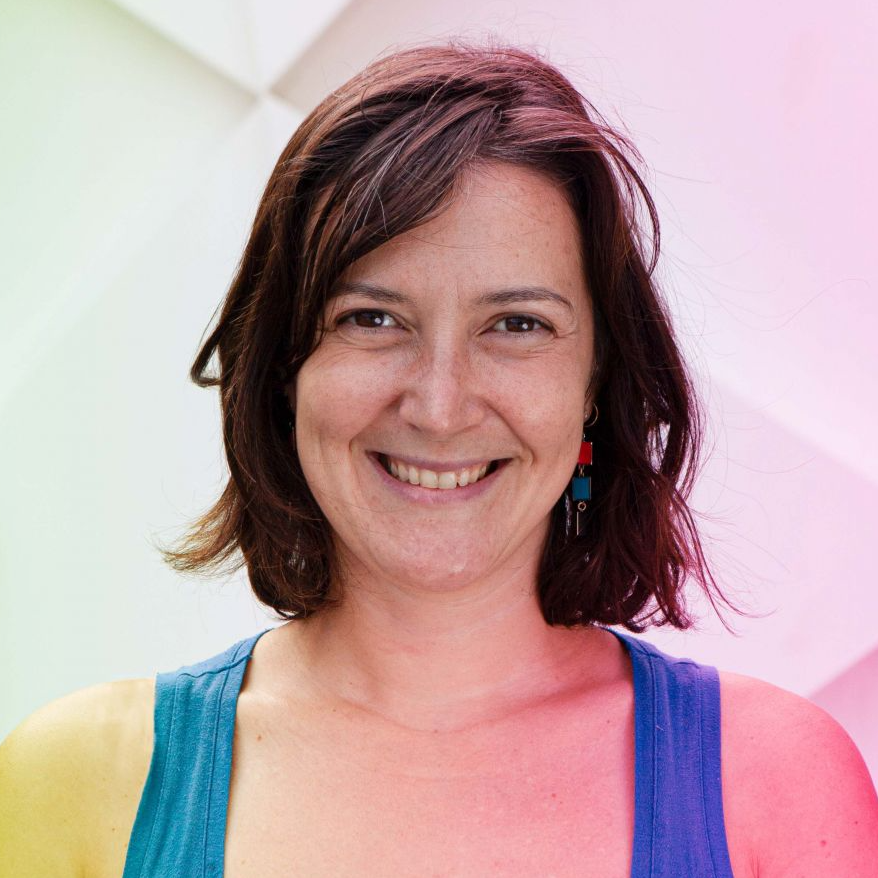
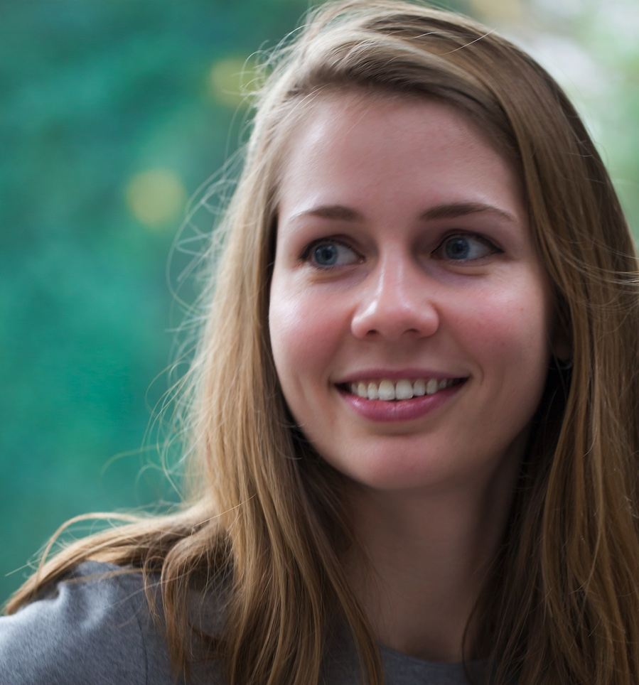
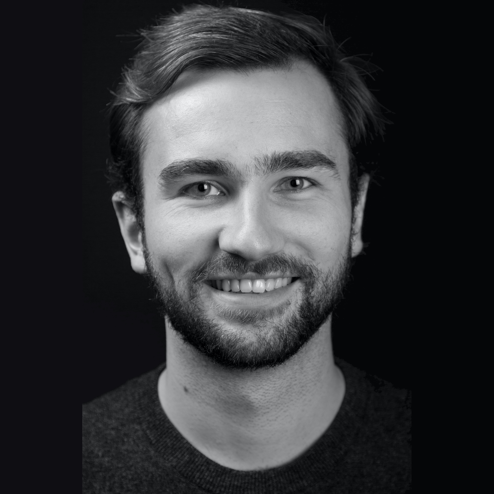
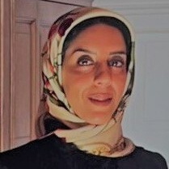
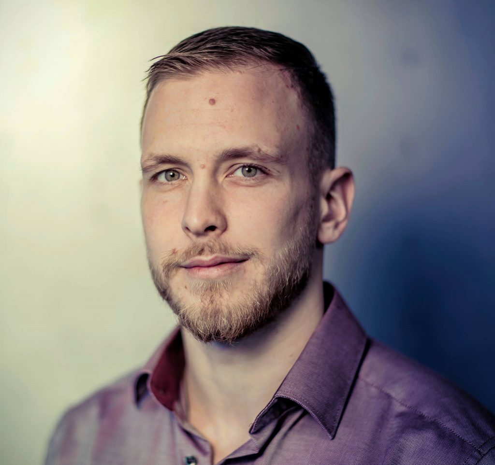
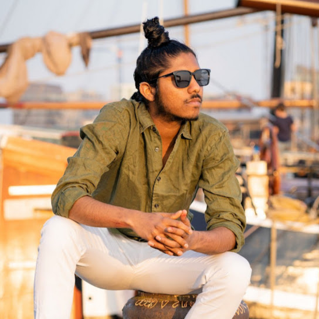
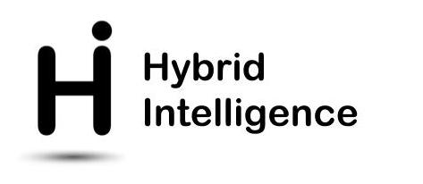
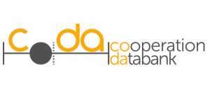
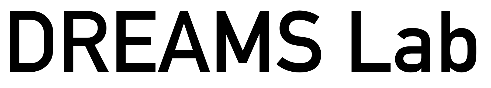

<nav><ul>
<li class="home"></li>
<li><a href="#contact">Contact</a></li>
<li><a href="#people">People</a></li>
<li><a href="#projects">Projects</a></li>
<li><a href="theses/">Student Theses</a></li>
</ul></nav>

The Knowledge in Artificial Intelligence (KAI) group studies the role of symbolic (formal/declarative) knowledge in Artificial Intelligence/AI-based systems. 

The mission of the KAI group is to contribute to a better understanding of the representation, acquisition, extraction and management of explicitly modelled knowledge and to facilitate and promote the usage of such knowledge in artificial intelligent agents. 

We do this by combining research from the fields of Knowledge Engineering and Knowledge Representation, with focus on how this contributes to Hybrid Intelligence (i.e. how knowledge helps to develop a collaborative, adaptive, explainable and responsible collaboration between artificial and human intelligence).

We combine foundational theory and applied methods such as computational logic, emergent semantics, narrative representation, abstract argumentation, knowledge engineering (at scale), knowledge graph management, semantic techniques, data integration as well as machine learning. Our research addresses a variety of types of knowledge, which can be heterogeneous, contextualised, dynamic, common-sense, process-dependent, personal, tribal, conflicting or biased, and often large-scale.

## Contact

## People

 Stefan Schlobach Acosiate Professor

 Ilaria Tiddi Assistant Professor

 Lise Stork Postdoc 

 Benno Kruit Postdoc 

 Romana Pernisch Postdoc /div>

 Atefeh Keshavarzi Zafarghandi Postdoc

 Márk Adamik PhD Student

 Loan Ho PhD Student

 Unmesh Joshi Guest

## Projects

