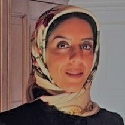

## People

    
 <a href="https://www.few.vu.nl/~schlobac/">Stefan Schlobach</a> Associate Professor 

    
 <a href="https://kmitd.github.io/ilaria/">Ilaria Tiddi</a> Assistant Professor 

    
 <a href="https://pkoopmann.github.io">Patrick Koopmann</a> Assistant Professor 

    
 <a href="https://jieyingchenchen.github.io/">Jieying Chen </a>Assistant Professor 

    
 Vera Stebletsova Lecturer  

    
 <a href="https://lisestork.github.io/">Lise Stork</a> Postdoc  

    
 <a href="http://bennokruit.nl">Benno Kruit</a> Postdoc  

    
 <a href="https://romana.pernisch.ch">Romana Pernisch</a> Postdoc 

    
 Atefeh Keshavarzi Zafarghandi Postdoc

    
 Márk Adamik PhD Student

    
 Loan Ho PhD Student

    
 Ritten Roothaert PhD Student

    
 Giacomo Zamprogno PhD Student

    
 Kai Obendrauf PhD Student

    
 Ameneh Naghdi Pour PhD Student

    
 Unmesh Joshi Guest

