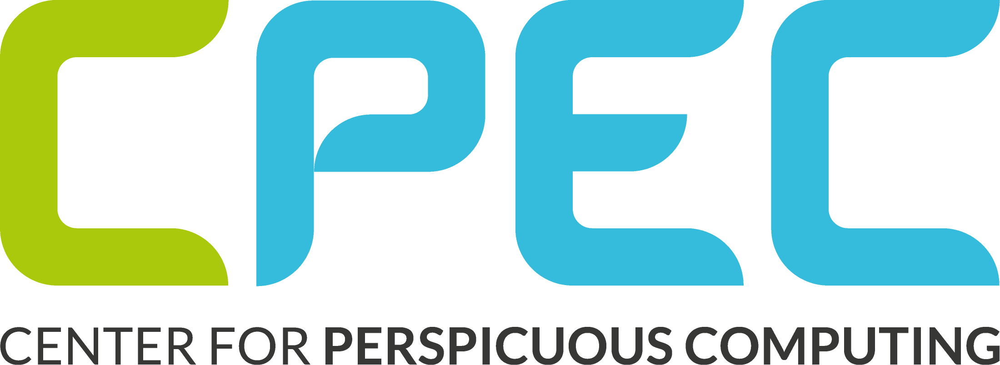

# Projects
<!-- 

  

  

  

  

  

  

  -->

  

      

        
      

      

        
      

      

        
      

      

        
      

      

        
      

      

        
      

  

       

